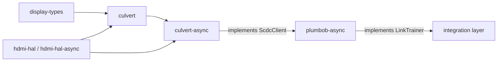

# culvert-async

[](https://github.com/DracoWhitefire/culvert-async/actions/workflows/ci.yml)
[](https://crates.io/crates/culvert-async)
[](https://docs.rs/culvert-async)
[](LICENSE)
[](https://blog.rust-lang.org/2025/02/20/Rust-1.85.0.html)

Async typed access to the HDMI 2.1 SCDC register map.

`culvert-async` is the async companion to [`culvert`], following the same design split as
`embedded-hal` / `embedded-hal-async`. It mirrors [`culvert::Scdc`] with `async fn` methods,
wrapping an [`hdmi_hal_async::scdc::ScdcTransport`] instead of a sync transport. All register
types and error types are re-exported from `culvert` so callers do not need both crates.

## Usage

```toml
[dependencies]
culvert-async = "0.1"
```

Wrap your async transport in `Scdc` and await typed methods:

```rust
use culvert_async::{Scdc, TmdsConfig, FrlConfig, FrlRate, FfeLevels};

let mut scdc = Scdc::new(transport);

// Version negotiation
let sink_ver = scdc.read_sink_version().await?;
scdc.write_source_version(1).await?;

// Enable TMDS scrambling
scdc.write_tmds_config(TmdsConfig {
    scrambling_enable: true,
    high_tmds_clock_ratio: true,
}).await?;

// Request an FRL rate
scdc.write_frl_config(FrlConfig {
    frl_rate: FrlRate::Rate12Gbps4Lanes,
    ffe_levels: FfeLevels::Ffe3,
    dsc_frl_max: false,
}).await?;

// Poll for training readiness
let flags = scdc.read_status_flags().await?;
if flags.flt_ready {
    // sink is ready for the LTP loop
}

// Read per-lane character error counts
let ced = scdc.read_ced().await?;
if let Some(count) = ced.lane0 {
    // lane 0 has a valid error count
}
```

To use `culvert-async` as the SCDC backend for `plumbob-async`'s link training state
machine, enable the `plumbob-async` feature:

```toml
[dependencies]
culvert-async  = { version = "0.1", features = ["plumbob-async"] }
plumbob-async  = "0.1"
```

`Scdc<T>` then implements `plumbob_async::ScdcClient` automatically.

## Register coverage

| Register group            | Addresses | Methods                                      |
|---------------------------|-----------|----------------------------------------------|
| Version                   | 0x01–0x02 | `read_sink_version`, `write_source_version`  |
| Update flags              | 0x10–0x11 | `read_update_flags`, `clear_update_flags`    |
| TMDS / scrambling         | 0x20–0x21 | `write_tmds_config`, `read_scrambler_status` |
| FRL config                | 0x30      | `write_frl_config`                           |
| FRL status                | 0x40–0x41 | `read_status_flags`                          |
| Character Error Detection | 0x50–0x57 | `read_ced`                                   |

## Features

| Feature         | Default | Description                                          |
|-----------------|---------|------------------------------------------------------|
| `plumbob-async` | no      | Implements `plumbob_async::ScdcClient` for `Scdc<T>` |

## `no_std`

`culvert-async` is `#![no_std]` throughout. All output types are stack-allocated; no
allocator is required in any configuration.

## Stack position



`culvert-async` does not depend on `plumbob-async`. The relationship runs the other way:
enabling the `plumbob-async` feature makes `Scdc<T>` implement
`plumbob_async::ScdcClient`. Any crate that implements `ScdcClient` is substitutable.

## Out of scope

- **Sync API** — callers on sync transports use [`culvert`] directly.
- **Link training state machine** — the sequencing of FRL training belongs in
  `plumbob-async`. `culvert-async` provides the register operations; the state machine
  decides when to call them.
- **PHY configuration** — `HdmiPhy` operations are the link training layer's concern.
- **I²C / DDC transport** — platform backends implement
  `hdmi_hal_async::scdc::ScdcTransport`. `culvert-async` never touches I²C directly.

## Documentation

- [`doc/setup.md`](doc/setup.md) — build, test, coverage, and example commands
- [`doc/testing.md`](doc/testing.md) — testing strategy, transport harness, and CI expectations
- [`doc/architecture.md`](doc/architecture.md) — role, scope, module structure, design
  principles, and implementation plan
- [`doc/roadmap.md`](doc/roadmap.md) — deferred register groups and planned API surfaces

## License

Licensed under the [Mozilla Public License 2.0](LICENSE).
